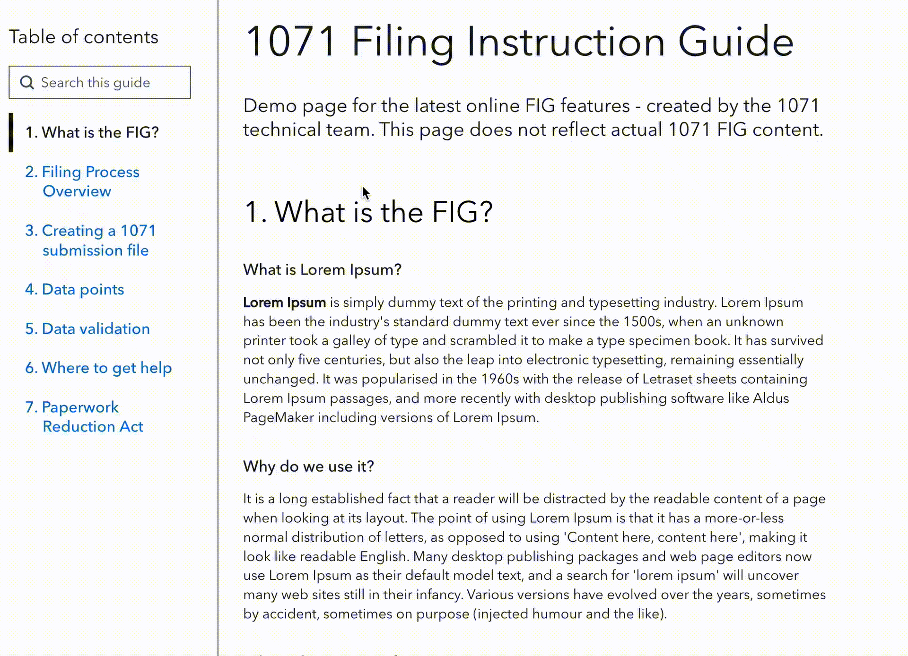

# ctrl-f

A simple search interface for client-side fuzzy searching.



## Usage

```
import search from 'ctrl-f';

const buttonText = 'Search this page';

const searchData = [
  {
    id: 123,
    title: 'The Grand Design',
    contents: 'The Grand Design examines the history of scientific knowledge about the universe and explains eleven-dimensional M-theory.'
    link: '#the-grand-design'
  },
  {
    id: 456,
    title: 'Metamorphosis',
    contents: 'Metamorphosis tells the story of salesman who wakes to find himself transformed into a huge insect and struggles to adjust to this new condition.'
    link: '#metamorphosis'
  }
];


const onClose = () => {
  console.log( 'search modal closed!' );
};

const onFollow = () => {
  console.log( 'a search result was followed (clicked/tapped)!' );
};

// Adds a "Search this page" button to the specified container element
// Clicking the button opens the search modal interface
search( document.querySelector('#container'), { buttonText, searchData, onClose, onFollow } );
```

## Options

Stay tuned.

## Development

#### `yarn`

Install dependencies.

#### `yarn start`

Runs the app in the development mode.\
Open [http://localhost:3000](http://localhost:3000) to view it in the browser.

The page will reload if you make edits.\
You will also see any lint errors in the console.

#### `yarn test`

Launches the test runner in the interactive watch mode.\
See the section about [running tests](https://facebook.github.io/create-react-app/docs/running-tests) for more information.

#### `yarn format`

Lints and formats all source files using [Prettier](https://prettier.io/).

#### `yarn build`

Builds the app for production to the `dist` folder.\
It correctly bundles React in production mode and optimizes the build for the best performance.

---

## Open source licensing info

1. [TERMS](TERMS.md)
2. [LICENSE](LICENSE)
3. [CFPB Source Code Policy](https://github.com/cfpb/source-code-policy/)
